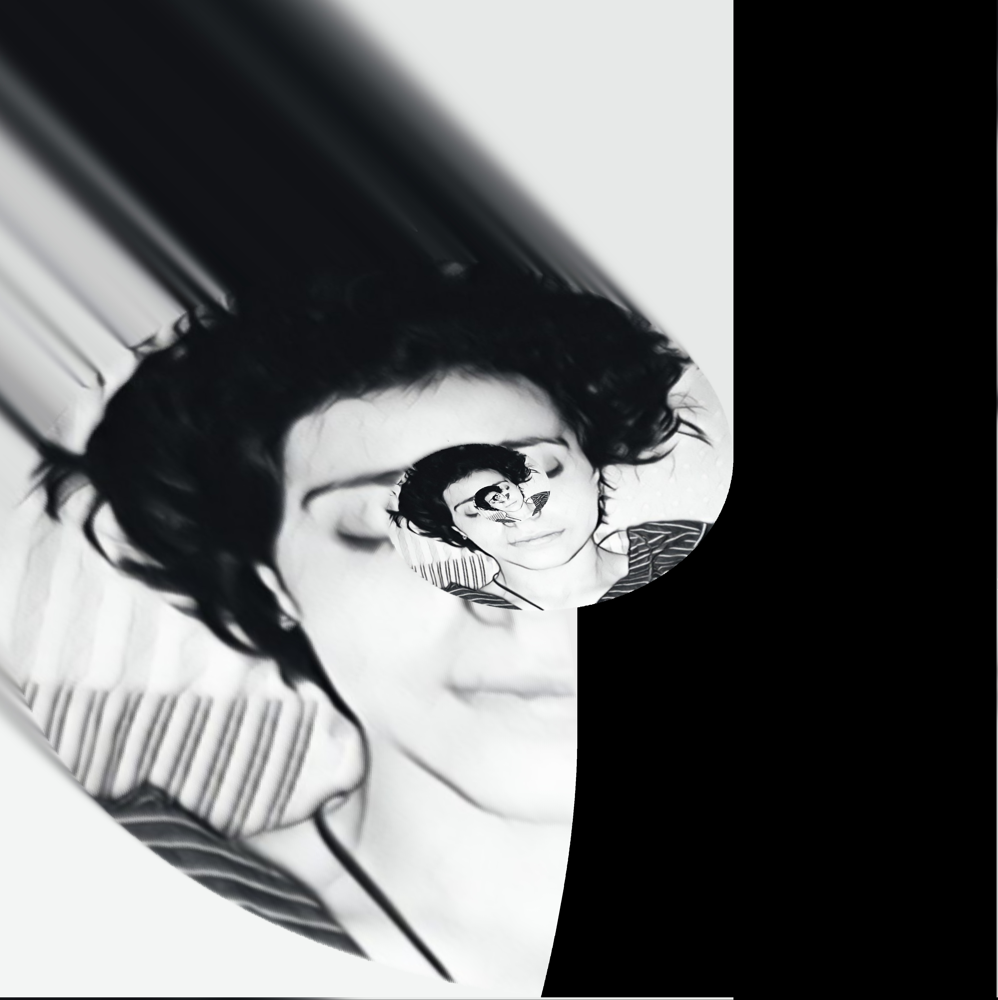
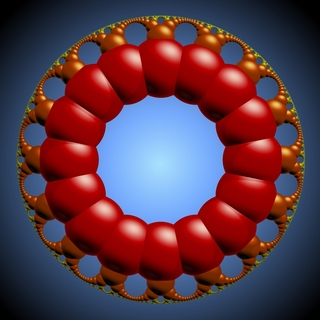
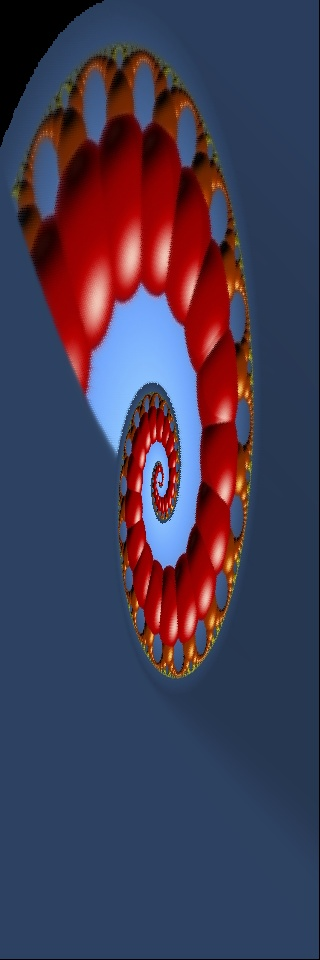

# Droste-Effect With Python
Here are some Before and After Images.










# Example Usage
first parameter is the image path
second parameter is the method(has to be 0 or 1)
third parameter is the number of repeats(must be odd)
```
python3 droste.py Images/Input.jpg 1 3 3
```
